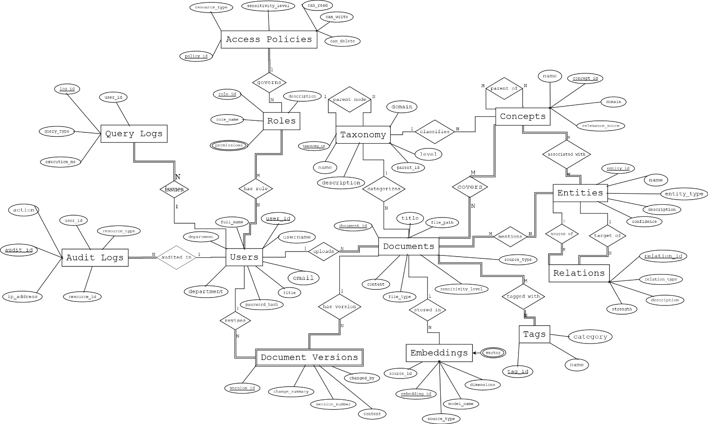
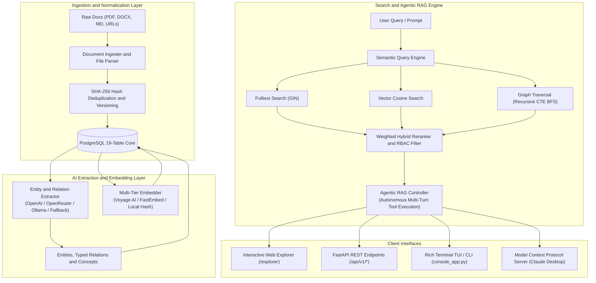

<div align="center">



### Enterprise AI Knowledge Graph & Agentic RAG Platform

<p>
  <a href="https://www.python.org/"></a>
  <a href="https://www.postgresql.org/"></a>
  <a href="https://fastapi.tiangolo.com/"></a>
  <a href="https://github.com/ompatelz/Omni-Graph_Omi/actions"></a>
  <a href="https://modelcontextprotocol.io/"></a>
  <a href="https://openrouter.ai/"></a>
</p>

<br />

Transform unstructured enterprise documents into a structured, searchable, AI-queryable knowledge graph.<br />
Ingest PDFs, DOCX, Markdown, URLs, or plain text. Query across four search strategies, an autonomous tool-calling RAG agent, an interactive Web Explorer, and an MCP server for Claude Desktop.

<br />

</div>

---

## Key Capabilities

OmniGraph ingests enterprise unstructured knowledge, extracts entities and relationships with AI, embeds representations with a resilient multi-tier embedder, and manages everything in an enterprise-grade 19-table PostgreSQL schema.

- **Ingest Any Source** -- PDF, DOCX, Markdown, URLs, or raw text with automatic normalization, SHA-256 deduplication, and immutable version trees.
- **Automated Knowledge Extraction** -- Multi-provider AI (OpenAI, OpenRouter, Ollama) extracts typed entities, bidirectional relationships, and concepts with confidence scores, backed by regex-keyword fallback.
- **Resilient Multi-Tier Embedder** -- Voyage AI (`voyage-3`, 1024d) -> FastEmbed (`bge-small-en-v1.5`, 384d) -> Zero-dependency deterministic subword feature hashing (`omnigraph-local-hash-v1`, 384d). Zero crashes, 100% offline testing reliability.
- **Four Search Strategies** -- Full-Text (PostgreSQL GIN tsvector), Semantic Vector (cosine similarity), Knowledge Graph Traversal, and Weighted Rank-Fused Hybrid Search with RBAC post-filtering.
- **Agentic RAG with Citations** -- Autonomous tool-calling reasoning loop (`hybrid_search`, `get_document_content`, `find_experts`, `find_related_concepts`) that provides factually grounded answers with verified `[doc_id=X]` citations and instant fallback to local extractive synthesis.
- **Interactive Web Explorer & Dashboard** -- Real-time Vis.js force-directed knowledge graph visualization, live RAG chat, multi-strategy comparison studio, document uploader, and analytics dashboard at `http://localhost:8000/`.
- **Codex-Style Terminal Console** -- Rich-rendered interactive TUI and non-blocking scriptable CLI (`--search`, `--ask`, `--stats`, `--user`, `--strategy`).
- **Model Context Protocol (MCP)** -- Native 13-tool MCP server for Anthropic Claude Desktop, Cursor, and Windsurf integration.
- **Enterprise Security & Governance** -- RBAC with 4 sensitivity levels (`public`, `internal`, `confidential`, `restricted`), row-level access verification, and tamper-evident audit logging.

---

## Architecture Overview



---

## Search Strategies

| Strategy | Mechanism | Best for |
|:---------|:----------|:---------|
| `fulltext` | PostgreSQL `tsvector` / `tsquery` with GIN indexes | Exact keywords, acronyms, code identifiers |
| `semantic` | Multi-tier vector embeddings, cosine distance | Natural-language questions, semantic synonyms |
| `graph` | Bidirectional recursive BFS graph traversal | Multi-hop connection discovery, entity neighborhoods |
| `hybrid` | Weighted fusion of Fulltext, Semantic, and Graph | Production queries requiring maximum precision and recall |

All search and retrieval results are strictly filtered according to the user's role-based access clearance.

---

## Client Interfaces

### 1. Interactive Web Explorer & RAG Dashboard
Launch FastAPI (`uvicorn api.main:app --port 8000`) and navigate to:
- **`http://localhost:8000/`** or **`http://localhost:8000/explorer`**
- **Features:**
  - **Knowledge Graph Canvas:** Interactive force-directed graph with color-coded node types, confidence meters, and neighborhood drill-down.
  - **Agentic RAG Chat:** Live tool execution trace pills, streaming markdown responses, and clickable citation tags `[doc_id=X]` that open document previews in a modal.
  - **Multi-Strategy Search Studio:** Side-by-side strategy benchmark with response timing (ms) and score breakdowns.
  - **Ingestion Studio:** Live text/file ingestion with real-time entity and relationship extraction viewer.
  - **Analytics & Governance:** System KPIs and entity distribution charts.

### 2. Codex-Style Terminal TUI & CLI
Run the rich terminal console or execute headless scriptable commands:
```bash
# Interactive Rich REPL
python -m omnigraph.console_app

# Quick headless CLI query
python -m omnigraph.console_app --search "kubernetes deployment" --strategy hybrid

# Headless Agentic RAG question
python -m omnigraph.console_app --ask "Who are the Deep Learning experts?"

# Print graph statistics
python -m omnigraph.console_app --stats
```

### 3. REST API
Interactive OpenAPI documentation is available at **`http://localhost:8000/docs`**.

<details>
<summary>Key REST Endpoints</summary>
<br />

| Method | Path | Description |
|:-------|:-----|:------------|
| `GET` | `/health` | Service health and capability flags |
| `GET` | `/` | Web Knowledge Graph Explorer Dashboard |
| `GET` | `/api/v1/graph/data` | Nodes and edges for network visualization |
| `GET` | `/api/v1/graph/stats` | Entity, relation, and concept aggregates |
| `GET` | `/api/v1/graph/entities` | Browse entities with type filter |
| `GET` | `/api/v1/graph/entities/{id}/neighborhood` | Multi-hop graph traversal |
| `POST` | `/api/v1/search` | Search (hybrid, semantic, fulltext, graph) |
| `POST` | `/api/v1/chat` | Conversational RAG agent with citations |
| `POST` | `/api/v1/documents/ingest` | Ingest raw text and extract graph elements |
| `POST` | `/api/v1/documents/upload` | Upload PDF, DOCX, or TXT file |
| `GET` | `/api/v1/documents/{id}` | Full document detail and content |
| `DELETE` | `/api/v1/documents/{id}` | Soft-archive document with audit trail |

</details>

### 4. Claude Desktop MCP Server
OmniGraph is a standard Model Context Protocol (MCP) server exposing 13 tools, 3 resources, and 3 prompt templates.

Add to `claude_desktop_config.json`:
```json
{
  "mcpServers": {
    "omnigraph": {
      "command": "python",
      "args": ["-m", "mcp_server.server"],
      "cwd": "/absolute/path/to/Omni-Graph_Omi",
      "env": {
        "OMNIGRAPH_DB_HOST": "localhost",
        "OMNIGRAPH_DB_NAME": "omnigraph",
        "OMNIGRAPH_DB_USER": "postgres",
        "OMNIGRAPH_DB_PASSWORD": "postgres"
      }
    }
  }
}
```

---

## Installation & Setup

### Prerequisites
- Python 3.11+
- PostgreSQL 16+ (with `vector` extension if available; falls back automatically to native arrays)

### 1. Clone and Install Dependencies
```bash
git clone https://github.com/ompatelz/Omni-Graph_Omi.git
cd Omni-Graph_Omi
pip install -r requirements.txt
```

### 2. Database Initialization
```bash
# Create database
createdb omnigraph

# Run schema, triggers, and sample data
psql -d omnigraph -f sql/schema.sql
psql -d omnigraph -f sql/sample_data.sql
psql -d omnigraph -f sql/procedures_triggers.sql
```

### 3. Configure Environment
Copy `.env.example` to `.env` and set your credentials:
```bash
cp .env.example .env
```
Key settings:
- `OMNIGRAPH_DB_HOST`: PostgreSQL host (default `localhost`)
- `OMNIGRAPH_DB_PORT`: PostgreSQL port (default `5432`)
- `OMNIGRAPH_DB_NAME`: Database name (default `omnigraph`)
- `OMNIGRAPH_DB_USER`: Database user (default `postgres`)
- `OMNIGRAPH_DB_PASSWORD`: Database password
- `OPENROUTER_API_KEY` / `OPENAI_API_KEY`: Optional for remote LLM extraction and agent chat (local fallback activates automatically when empty)
- `VOYAGE_API_KEY`: Optional for Voyage AI embeddings

### 4. Run Verification Tests
```bash
# Run full automated test suite (68 tests)
python -m pytest tests/ -v

# Run comprehensive system smoke test
python test_omnigraph.py
```

### 5. Launch the Web Application
```bash
uvicorn api.main:app --reload --port 8000
```
Open **`http://localhost:8000/`** to explore the knowledge graph and interact with the RAG agent.

---

## License
MIT License. Built for enterprise knowledge graphs and autonomous agentic workflows.
